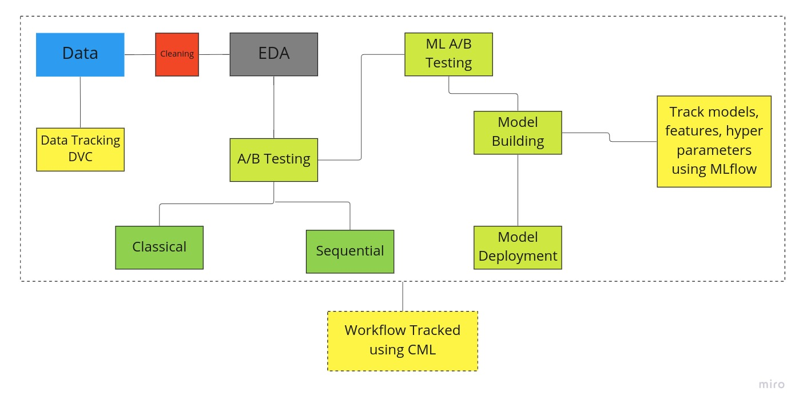

# abtest-mlops

**Table of Contents**
- [Overview](#overview)
- [Pipeline Design](#pipeline-design)
- [Approach](#approach)
- [Project Structure](#project-structure)
   - [data](#data)
    - [models](#models)
    - [notebooks](#notebooks)
    - [scripts_](#scripts_)
 - [Install](#install)
  
## Overview

SmartAd is a mobile first advertiser agency. It designs intuitive touch-enabled advertising. It provides brands with an automated advertising experience via machine learning and creative excellence. Their company is based on the principle of voluntary participation which is proven to increase brand engagement and memorability 10 x more than static alternatives.

SmartAd provides an additional service called Brand Impact Optimiser (BIO), a lightweight questionnaire, served with every campaign to determine the impact of the creative, the ad they design, on various upper funnel metrics, including memorability and brand sentiment.


The main objective of this project is to test if the ads that the advertising company runs resulted in a significant lift in brand awareness. 


## Pipeline Design



## Approach

The following two different types of A/B testing were used in the analysis.
* Classic A/B testing
* Sequential A/B testing

## Project Structure
The repository has a number of files including python scripts, jupyter notebooks, README.md and csv files.

   ### data:
      - the folder where the dataset csv file is stored.
      
   ### notebook:
      - the folder where the jupyter notebook files are stored.
   
   ### scripts:
      - the folder where python script files are stored.
      
   ### models:
      - the folder where python model files will be stored.

## Install

```
git clone https://github.com/Melak2017/abtest-mlops.git
cd abtest-mlops
pip install -r requirements.txt
